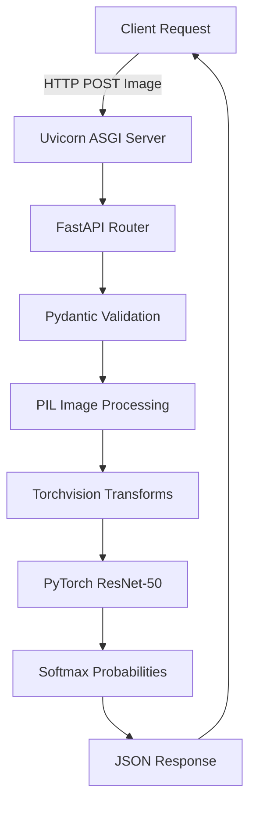

# Comprehensive Interview Preparation Guide: Anime-Or-Not Classification API

## 1. High-Level Overview
### What problem does this project solve?
This project provides an automated, scalable solution to distinguish between anime-style images and western cartoon-style images. It wraps a deep learning model in a RESTful API, allowing external applications (like content moderation systems or recommendation engines) to easily classify images.

### What is the overall architecture?
The system follows a Monolithic Microservice architecture.
1. **Client Layer**: Sends HTTP POST requests containing images.
2. **API Layer (FastAPI & Uvicorn)**: Handles routing, data validation (Pydantic), and HTTP error handling.
3. **Processing Layer (PIL & Torchvision)**: Decodes the binary image and applies standard ImageNet transformations.
4. **Inference Layer (PyTorch)**: A ResNet-50 Convolutional Neural Network processes the tensor and outputs logits.
5. **Deployment Layer (Docker)**: The entire application is packaged in a Debian-based Python Docker image for portability.

### Request/Data Flow
1. Client sends `POST /predict` with `multipart/form-data` containing an image.
2. FastAPI endpoint `predict_endpoint` receives the file.
3. Content-type is validated (`image/jpeg` or `image/png`).
4. File bytes are read and passed to PIL `Image.open`.
5. The PIL image is passed to `model.predict()`.
6. `transforms.Compose` resizes to 256, crops to 224x224, converts to Tensor, and normalizes.
7. The PyTorch tensor `(1, 3, 224, 224)` is passed through ResNet-50 under `torch.no_grad()`.
8. Logits are passed through `torch.softmax` to get confidence scores.
9. `argmax` finds the predicted label.
10. The result is returned as a Pydantic `Prediction` object.
11. FastAPI serializes it to JSON and returns HTTP 200 OK.

### Architecture Diagram

### Component Communication
- **HTTP**: Client to Uvicorn.
- **ASGI**: Uvicorn to FastAPI.
- **Python Objects**: FastAPI passes raw bytes to PIL. PIL passes `Image` to Torchvision. PyTorch passes Tensors through layers.
- **JSON**: FastAPI serialization of Pydantic models back to the client.

---

## 2. Folder Structure

- **`main.py`**: API Entrypoint. Serves as the web interface for the ML model.
- **`model.py`**: Machine Learning Core. Isolates complex ML logic from web routing logic.
- **`schemas.py`**: Data Contracts. Provides type safety and automatic Swagger documentation.
- **`train.py`**: Model Training Script. Enables reproducible training.
- **`evaluate.py`**: Model Evaluation Script. Used to empirically prove model performance.
- **`Dockerfile`**: Containerization. Ensures consistent deployments.
- **`pytest.ini`**: Test Configuration. Ensures `pytest` can find `main.py`.
- **`requirements.txt`**: Dependency locking. Tells `pip` what to install.

---

## 3. Technologies Used

- **FastAPI**
  - **Why**: Fastest Python web framework, automatic docs, type safety.
  - **Alternatives**: Flask, Django, Starlette (base).
  - **Pros**: Speed, DX, Pydantic integration.
  - **Cons**: Less mature ecosystem than Django.
  - **Tradeoffs**: Async is great, but PyTorch blocks unless handled via threadpools.
  - **Interview Q**: "Why FastAPI over Flask?"
  - **Answer**: "FastAPI leverages Python type hints to provide automatic validation and OpenAPI docs, saving boilerplate while offering superior performance."

- **PyTorch**
  - **Why**: Industry standard, intuitive eager execution.
  - **Alternatives**: TensorFlow, JAX.
  - **Pros**: Easy to debug, huge community.
  - **Cons**: Deployment can be heavier than TF-Serving.
  - **Interview Q**: "Why PyTorch?"
  - **Answer**: "Its dynamic computational graph allows for rapid prototyping, and Torchvision provides robust pre-trained models."

- **Docker**
  - **Why**: Environment consistency.
  - **Alternatives**: VMs, Podman.
  - **Pros**: Isolation, scalability.
  - **Cons**: Adds overhead, image sizes can be large.
  - **Interview Q**: "How did you optimize the Dockerfile?"
  - **Answer**: "By using a `slim` base image, installing the CPU version of PyTorch, and copying `requirements.txt` first to cache dependencies."

- **Pydantic**
  - **Why**: Data validation.
  - **Pros**: Enforces schemas at runtime.
  - **Interview Q**: "What does Pydantic do?"
  - **Answer**: "It guarantees that incoming/outgoing data matches the defined Python types, rejecting invalid data automatically."

---

## 4. Architecture Decisions

### Decision: Monolithic API and Inference
- **Why**: Simplicity and fast time-to-market.
- **Alternatives**: Message queue with separate GPU workers.
- **Tradeoffs**: Easy deployment vs. poor scalability under high concurrent load.
- **If 100x larger**: Move inference to Triton Inference Server, use Kafka for async processing, and Kubernetes for autoscaling.
- **Redesign**: Decouple API (FastAPI) from Inference (Triton).
- **Bottleneck**: The synchronous `predict` function blocks FastAPI worker threads.

### Decision: ResNet-50 Architecture
- **Why**: Balances accuracy and inference speed.
- **Alternatives**: MobileNet, EfficientNet.
- **Tradeoffs**: Larger size (100MB+) but higher accuracy than mobile nets.

---

## 5. Backend Deep Dive
- **API Endpoints**: POST `/predict`, GET `/health`.
- **Controllers**: Handled directly in `main.py` via FastAPI decorators.
- **Business Logic**: `model.py` encapsulates the inference.
- **Dependency Injection**: FastAPI `File(...)` injects the uploaded file.
- **Authentication/Authorization**: None currently.
- **Validation**: Pydantic validates the output schema. File MIME types are validated manually.
- **Exception Handling**: Raises `HTTPException` for 400 (Bad Request) and 415 (Unsupported Media Type).
- **Thread Safety**: The PyTorch model is thread-safe for inference (since gradients aren't tracked).
- **Concurrency**: FastAPI runs the synchronous endpoint in a threadpool (Starlette's default behavior).

---

## 6. Database
- **Currently**: No database. Stateless architecture.
- **Improvements**: If required, use PostgreSQL to log predictions, and S3 to store images.
- **Schema Idea**: `Predictions (id UUID, label VARCHAR, confidence FLOAT, created_at TIMESTAMP)`.
- **Interview Q**: "How would you store these images?"
- **Answer**: "Store the raw images in AWS S3 and save the S3 URL alongside the prediction result in a PostgreSQL database."

---

## 7. Security
- **Authentication**: Missing. Add JWT or API Keys.
- **Secrets Management**: Currently none. Should use environment variables or AWS Secrets Manager for DB credentials.
- **Vulnerabilities**:
  1. **OOM via large files**: No file size limit. Attacker can upload a 2GB file.
  2. **Pickle Vulnerability**: `torch.load` can execute malicious code. Use `safetensors`.
- **Improvements**: Implement Rate Limiting, File Size Limits, CORS middleware, and input sanitization.

---

## 8. API Design
- **REST Principles**: Uses nouns (`/predict`), correct HTTP verbs (POST).
- **Status Codes**: 200 for success, 400 for bad input, 415 for unsupported types.
- **Validation**: Strict output validation via Pydantic.
- **Error Handling**: Standard JSON error responses provided by FastAPI.
- **Improvements**: Version the API (`/v1/predict`).

---

## 9. Performance
- **Slow Code**: Inference is CPU-bound and takes significant time.
- **Memory Issues**: Loading multiple Uvicorn workers will load the model into RAM multiple times.
- **Duplicate Work**: Re-initializing the model on every worker.
- **Optimization**: Use ONNX Runtime or TensorRT. Implement dynamic batching.

---

## 10. Design Patterns
- **Singleton**: The model in `model.py` acts as a module-level singleton. It's loaded once and reused.
- **Facade**: `predict()` hides the complexity of tensors, transforms, and softmax from the API layer.
- **Decorator**: `@app.post` extends the function's behavior to handle HTTP routing.

---

## 11. Object-Oriented Design
- **SOLID**:
  - **Single Responsibility**: Respected. `main.py` does HTTP, `model.py` does ML.
- **Encapsulation**: Details of image transformation are hidden inside `model.py`.
- **Improvements**: Create a `ModelService` class instead of global variables to allow easier mocking during testing.

---

## 12. System Design Perspective (10 Million Users)
- **Bottlenecks**: CPU inference, synchronous HTTP.
- **Scaling Strategy**:
  - **API**: Load balancer (AWS ALB) -> Auto-scaling group of FastAPI containers.
  - **Inference**: Kafka topic -> GPU Inference Workers (Triton).
  - **Storage**: S3 for images, Redis for caching, PostgreSQL for metadata.
- **High Availability**: Multi-AZ deployment.

---

## 13. Testing
- **Current**: Testing configuration (`pytest.ini`) and basic API tests (`test_api.py`) exist.
- **Missing**: Unit tests for ML components, Integration tests for failure modes.
- **How to improve**:
  - Mock the PyTorch model to test API routing and validation without loading heavy weights.
  - Test edge cases (corrupted images, extremely large files, wrong file types).

---

## 14. DevOps
- **Docker**: Uses a slim base image, caches dependencies.
- **CI/CD**: Should add GitHub Actions to run tests, build Docker image, and push to ECR.
- **Production**: Run with Gunicorn instead of direct Uvicorn (`gunicorn main:app -k uvicorn.workers.UvicornWorker`).
- **Health Checks**: `/health` endpoint is available for Kubernetes liveness/readiness probes.

---

## 15. Code Review
- **Good**: Modularity, clean API, handling class imbalance via Sampler.
- **Bad**: Catching broad `Exception` in `main.py`.
- **Refactoring**: Move hardcoded paths (`checkpoints/...pth`) to environment variables. Add logging for failed validations.

---

## 16. Interview Questions (75 Questions)

### Easy Questions
#### 1. What does `EXPOSE 80` do in a Dockerfile?
- **The ideal answer:** Documents the port, doesn't actually bind it.
- **Why interviewers ask it:** Basic Docker knowledge.
- **Common mistakes candidates make:** Thinking it automatically maps the port.
- **Follow-up questions:** How do you map the port when running?

#### 2. What is FastAPI?
- **The ideal answer:** A modern, fast web framework for building APIs with Python 3.7+ based on standard Python type hints.
- **Why interviewers ask it:** Checking framework knowledge.
- **Common mistakes candidates make:** Confusing it with Flask.
- **Follow-up questions:** Why is it faster than Flask?

#### 3. What is PyTorch?
- **The ideal answer:** An open-source machine learning framework.
- **Why interviewers ask it:** Basic ML knowledge.
- **Common mistakes candidates make:** Confusing it with TensorFlow.
- **Follow-up questions:** What is a Tensor?

#### 4. What does `torch.no_grad()` do?
- **The ideal answer:** Disables gradient calculation to save memory and speed up inference.
- **Why interviewers ask it:** Basic PyTorch inference knowledge.
- **Common mistakes candidates make:** Forgetting it during evaluation.
- **Follow-up questions:** What happens if you don't use it?

#### 5. What is ResNet50?
- **The ideal answer:** A 50-layer Convolutional Neural Network with residual connections.
- **Why interviewers ask it:** Checking architecture knowledge.
- **Common mistakes candidates make:** Not knowing what 'residual' means.
- **Follow-up questions:** Why 50 layers?

#### 6. What is Uvicorn?
- **The ideal answer:** An ASGI web server implementation for Python.
- **Why interviewers ask it:** Checking deployment knowledge.
- **Common mistakes candidates make:** Confusing it with Gunicorn.
- **Follow-up questions:** What does ASGI stand for?

#### 7. Why use Pydantic?
- **The ideal answer:** For data validation and settings management using Python type annotations.
- **Why interviewers ask it:** Checking validation knowledge.
- **Common mistakes candidates make:** Thinking it's an ORM.
- **Follow-up questions:** How does it integrate with FastAPI?

#### 8. What is a `WeightedRandomSampler`?
- **The ideal answer:** Samples elements from [0,..,len-1] with given probabilities.
- **Why interviewers ask it:** Checking class imbalance handling.
- **Common mistakes candidates make:** Thinking it changes the loss function.
- **Follow-up questions:** How do you calculate the weights?

#### 9. What is PIL?
- **The ideal answer:** Python Imaging Library, used for image processing.
- **Why interviewers ask it:** Basic Python knowledge.
- **Common mistakes candidates make:** Confusing it with OpenCV.
- **Follow-up questions:** How do you convert an image to RGB?

#### 10. What does `@app.get` do?
- **The ideal answer:** A decorator in FastAPI used to define a GET endpoint.
- **Why interviewers ask it:** Basic REST knowledge.
- **Common mistakes candidates make:** Using it for POST requests.
- **Follow-up questions:** What is the difference between GET and POST?

### Medium Questions
#### 11. How does FastAPI handle asynchronous code?
- **The ideal answer:** It uses `asyncio`. For synchronous endpoints (`def`), it runs them in a separate threadpool to avoid blocking the event loop.
- **Why interviewers ask it:** Checking async knowledge.
- **Common mistakes candidates make:** Thinking synchronous endpoints block everything.
- **Follow-up questions:** When should you use `async def` vs `def`?

#### 12. How did you handle class imbalance?
- **The ideal answer:** By using a `WeightedRandomSampler` to oversample the minority class (anime) during training.
- **Why interviewers ask it:** Checking ML problem solving.
- **Common mistakes candidates make:** Just saying 'collected more data'.
- **Follow-up questions:** What is an alternative to oversampling?

#### 13. Why is the Dockerfile structured with `COPY requirements.txt .` first?
- **The ideal answer:** To take advantage of Docker layer caching. If `requirements.txt` doesn't change, pip install is cached.
- **Why interviewers ask it:** Checking Docker optimization.
- **Common mistakes candidates make:** Not knowing about layer caching.
- **Follow-up questions:** How do you reduce the final image size?

#### 14. What is the purpose of the `transforms.Normalize` step?
- **The ideal answer:** Standardizes image pixels using ImageNet mean and standard deviation, which is required since ResNet was pretrained on ImageNet.
- **Why interviewers ask it:** Checking ML preprocessing.
- **Common mistakes candidates make:** Using random normalization values.
- **Follow-up questions:** What happens if you skip this step?

#### 15. How do you load the saved weights in PyTorch?
- **The ideal answer:** Using `torch.load()` and `model.load_state_dict()`.
- **Why interviewers ask it:** Checking PyTorch mechanics.
- **Common mistakes candidates make:** Just loading the model directly.
- **Follow-up questions:** What does `map_location` do?

#### 16. What is a confusion matrix?
- **The ideal answer:** A table used to describe the performance of a classification model (True Positives, False Positives, etc.).
- **Why interviewers ask it:** Checking evaluation knowledge.
- **Common mistakes candidates make:** Confusing precision and recall.
- **Follow-up questions:** What is F1 score?

#### 17. How does the `predict` endpoint validate input?
- **The ideal answer:** Checks the `content_type` of the `UploadFile` and then tries to parse it with PIL. If it fails, it raises an HTTPException.
- **Why interviewers ask it:** Checking API security.
- **Common mistakes candidates make:** Trusting the file extension.
- **Follow-up questions:** How can you prevent a large file from crashing the server?

#### 18. What does `model.eval()` do?
- **The ideal answer:** Sets the model to evaluation mode, which changes the behavior of layers like Dropout and BatchNorm.
- **Why interviewers ask it:** Checking PyTorch evaluation.
- **Common mistakes candidates make:** Confusing it with `torch.no_grad()`.
- **Follow-up questions:** What happens if you forget it?

#### 19. How would you monitor this API?
- **The ideal answer:** I would add metrics like latency and request count using tools like Prometheus and Datadog, and logging with Loguru.
- **Why interviewers ask it:** Checking observability.
- **Common mistakes candidates make:** Only saying 'I check the logs'.
- **Follow-up questions:** How do you track a request across multiple microservices?

#### 20. What is transfer learning?
- **The ideal answer:** Taking a model trained on a large dataset (ImageNet) and fine-tuning it on a smaller dataset for a specific task.
- **Why interviewers ask it:** Checking ML concepts.
- **Common mistakes candidates make:** Thinking it's training from scratch.
- **Follow-up questions:** Why freeze layers?

### Hard Questions
#### 21. How would you scale this API to handle 10,000 requests per second?
- **The ideal answer:** I would decouple the API and inference. The API accepts requests and puts them on a message queue (Kafka). GPU worker nodes pull batches of images, run inference, and store results in Redis.
- **Why interviewers ask it:** Checking system design.
- **Common mistakes candidates make:** Just saying 'add more Docker containers'.
- **Follow-up questions:** How do you return the result to the user?

#### 22. What is dynamic batching?
- **The ideal answer:** Grouping multiple individual inference requests that arrive closely in time into a single batch to maximize GPU utilization.
- **Why interviewers ask it:** Checking advanced serving.
- **Common mistakes candidates make:** Thinking it means batch size during training.
- **Follow-up questions:** What framework supports this out of the box? (Triton)

#### 23. What are the security implications of using `torch.load`?
- **The ideal answer:** It uses Python's `pickle` module, which can execute arbitrary code if the `.pth` file is malicious. We should use `safetensors` instead.
- **Why interviewers ask it:** Checking ML security.
- **Common mistakes candidates make:** Not knowing about pickle vulnerabilities.
- **Follow-up questions:** How do you mitigate this?

#### 24. Explain the Global Interpreter Lock (GIL) and how it affects this app.
- **The ideal answer:** The GIL prevents multiple native threads from executing Python bytecodes at once. CPU-bound tasks like image preprocessing will be bottlenecked by the GIL, even if FastAPI uses a threadpool.
- **Why interviewers ask it:** Checking Python internals.
- **Common mistakes candidates make:** Thinking threads are truly parallel in Python.
- **Follow-up questions:** Does PyTorch release the GIL?

#### 25. How do residual connections solve the vanishing gradient problem?
- **The ideal answer:** They provide a shortcut path for the gradient to flow backwards during backpropagation, bypassing layers that might otherwise diminish the gradient to zero.
- **Why interviewers ask it:** Checking deep learning math.
- **Common mistakes candidates make:** Not knowing the math behind backprop.
- **Follow-up questions:** What is the formula for a residual block?

#### 26. What happens if a user uploads a 5GB image?
- **The ideal answer:** The server will attempt to read it into memory (`contents = file.file.read()`), which will cause an Out of Memory (OOM) error and crash the worker.
- **Why interviewers ask it:** Checking API limits.
- **Common mistakes candidates make:** Assuming FastAPI handles it automatically.
- **Follow-up questions:** How do you implement streaming validation?

#### 27. How would you deploy this model to edge devices (e.g., mobile)?
- **The ideal answer:** I would convert the model to ONNX or TorchScript, and possibly quantize it from FP32 to INT8 to reduce size and improve inference speed.
- **Why interviewers ask it:** Checking edge deployment.
- **Common mistakes candidates make:** Trying to run the Python server on a phone.
- **Follow-up questions:** What is quantization?

#### 28. Why does the model output 2 features in `nn.Linear(..., 2)`?
- **The ideal answer:** Because it's a binary classification task (Anime vs Cartoon).
- **Why interviewers ask it:** Checking model modification.
- **Common mistakes candidates make:** Using 1 feature with Sigmoid (which is also valid but different).
- **Follow-up questions:** Could you do this with 1 output node? How?

#### 29. How do you handle memory leaks in a PyTorch serving app?
- **The ideal answer:** Ensure variables like tensors aren't kept in lists unnecessarily, use `.item()` or `.cpu()` to detach from the computational graph, and monitor RAM usage.
- **Why interviewers ask it:** Checking debugging.
- **Common mistakes candidates make:** Not knowing what causes OOM.
- **Follow-up questions:** What tool profiles memory in Python?

#### 30. How would you implement A/B testing for a new model version?
- **The ideal answer:** I would use a routing layer (like Istio or an API Gateway) to send a percentage of traffic to the new model container and compare business metrics.
- **Why interviewers ask it:** Checking MLOps.
- **Common mistakes candidates make:** Deploying both models in the same container.
- **Follow-up questions:** What is shadow deployment?

### Very Hard Questions
#### 31. Design an architecture where this model needs to process continuous video streams.
- **The ideal answer:** Use WebSockets or WebRTC to stream frames. Use a dedicated inference server (Triton) with TensorRT optimization. Buffer frames and run dynamic batching.
- **Why interviewers ask it:** Checking real-time systems.
- **Common mistakes candidates make:** Processing frame by frame synchronously via HTTP POST.
- **Follow-up questions:** How do you handle frame drops?

#### 32. Explain how `WeightedRandomSampler` interacts with PyTorch's `DataLoader` multiprocessing.
- **The ideal answer:** The sampler yields indices which the main process puts into a queue. Worker processes fetch indices, load images, apply transforms, and put tensors into a result queue.
- **Why interviewers ask it:** Checking PyTorch internals.
- **Common mistakes candidates make:** Thinking workers generate their own indices.
- **Follow-up questions:** What happens if `num_workers` is too high?

#### 33. If inference latency spikes unexpectedly, how do you debug it?
- **The ideal answer:** I would check CPU/GPU utilization, memory swapping, thread pool exhaustion in Uvicorn, and Python garbage collection pauses.
- **Why interviewers ask it:** Checking deep debugging.
- **Common mistakes candidates make:** Only checking code.
- **Follow-up questions:** How do you profile an ASGI app?

#### 34. How would you rewrite the FastAPI app to be fully asynchronous including the model inference?
- **The ideal answer:** You can't easily make PyTorch model inference truly async in pure Python. You would offload it to a dedicated process using `ProcessPoolExecutor` or an external service (TorchServe/gRPC) and await the result.
- **Why interviewers ask it:** Checking async limitations.
- **Common mistakes candidates make:** Putting `await` in front of `model(x)`.
- **Follow-up questions:** What is `run_in_executor`?

#### 35. What are the tradeoffs of using CrossEntropyLoss over BinaryCrossEntropy (BCE) for a 2-class problem?
- **The ideal answer:** CrossEntropy requires 2 output nodes and applies Softmax. BCE requires 1 output node and applies Sigmoid. CE is easier to extend to multi-class, BCE is slightly more efficient for binary.
- **Why interviewers ask it:** Checking loss function math.
- **Common mistakes candidates make:** Not knowing BCE exists.
- **Follow-up questions:** Is there a performance difference?

#### 36. How do you protect this endpoint against a Slowloris attack?
- **The ideal answer:** Since Uvicorn is susceptible, you should place a reverse proxy like NGINX or a load balancer (AWS ALB) in front of it to buffer requests.
- **Why interviewers ask it:** Checking network security.
- **Common mistakes candidates make:** Trying to fix it in Python code.
- **Follow-up questions:** What is a Slowloris attack?

#### 37. How would you implement caching for predictions?
- **The ideal answer:** I would hash the incoming image file (e.g., MD5 or SHA-256) and check a Redis cache before running inference. If found, return the cached result.
- **Why interviewers ask it:** Checking optimization.
- **Common mistakes candidates make:** Caching by filename (which can collide).
- **Follow-up questions:** What are the tradeoffs of hashing large images?

#### 38. If you deploy this in Kubernetes, how do you configure the Horizontal Pod Autoscaler (HPA)?
- **The ideal answer:** I would scale based on CPU utilization or custom metrics like request queue length (using KEDA).
- **Why interviewers ask it:** Checking K8s scaling.
- **Common mistakes candidates make:** Scaling based on memory.
- **Follow-up questions:** Why is scaling by memory dangerous for Python apps?

#### 39. Describe how you would quantize this ResNet50 model to INT8 using PyTorch.
- **The ideal answer:** Use PyTorch's Post-Training Static Quantization (PTSQ). Insert `QuantStub` and `DeQuantStub`, calibrate with a representative dataset to find activation ranges, and convert.
- **Why interviewers ask it:** Checking advanced optimization.
- **Common mistakes candidates make:** Just saying 'cast to int8'.
- **Follow-up questions:** What is Quantization Aware Training (QAT)?

#### 40. If the API is deployed in multiple regions, how do you handle routing?
- **The ideal answer:** Use Global Server Load Balancing (GSLB) or AWS Route 53 with latency-based or geolocation routing to direct users to the closest healthy region.
- **Why interviewers ask it:** Checking global system design.
- **Common mistakes candidates make:** Using a single load balancer for the world.
- **Follow-up questions:** How do you handle data residency laws?

### Behavioral Questions
#### 41. Tell me about a time you disagreed with a team member about an architectural decision.
- **The ideal answer:** Use STAR format. Explain the disagreement (e.g., REST vs gRPC), the discussion, and the resolution.
- **Why interviewers ask it:** Checking conflict resolution.
- **Common mistakes candidates make:** Saying you always agree.
- **Follow-up questions:** How do you handle it if you are overruled?

#### 42. Describe a time you had to optimize a slow system.
- **The ideal answer:** Use STAR format. Mention identifying the bottleneck (e.g., synchronous inference) and the solution (e.g., batching or caching).
- **Why interviewers ask it:** Checking performance optimization experience.
- **Common mistakes candidates make:** Just changing code blindly.
- **Follow-up questions:** How did you measure the improvement?

#### 43. Tell me about a bug that took you a long time to fix.
- **The ideal answer:** Discuss a complex issue like a memory leak, race condition, or a PyTorch tensor device mismatch.
- **Why interviewers ask it:** Checking debugging persistence.
- **Common mistakes candidates make:** Mentioning a simple syntax error.
- **Follow-up questions:** What did you learn from it?

#### 44. How do you keep up with new technologies in machine learning and backend engineering?
- **The ideal answer:** Reading papers, following open-source projects (FastAPI, PyTorch), building side projects.
- **Why interviewers ask it:** Checking passion for tech.
- **Common mistakes candidates make:** Saying you don't.
- **Follow-up questions:** What was the last paper you read?

#### 45. Tell me about a time you had to learn a new framework quickly.
- **The ideal answer:** Use STAR format. Explain how you read docs, built a prototype, and asked questions.
- **Why interviewers ask it:** Checking adaptability.
- **Common mistakes candidates make:** Saying it was easy.
- **Follow-up questions:** How do you know when you know enough to start coding?

#### 46. Tell me about a time you received negative feedback on a code review.
- **The ideal answer:** Acknowledge the feedback, learn from it, and improve the code without taking it personally.
- **Why interviewers ask it:** Checking ego and growth mindset.
- **Common mistakes candidates make:** Getting defensive.
- **Follow-up questions:** What specifically did you change?

#### 47. Describe a situation where you had to make a tradeoff between speed of delivery and code quality.
- **The ideal answer:** Discuss delivering an MVP with known technical debt, documenting it, and scheduling time to refactor later.
- **Why interviewers ask it:** Checking pragmatism.
- **Common mistakes candidates make:** Always choosing quality or always choosing speed.
- **Follow-up questions:** Did you ever fix the tech debt?

#### 48. How do you prioritize your work when you have multiple competing deadlines?
- **The ideal answer:** Use techniques like Eisenhower matrix, communicate with stakeholders, and break tasks down.
- **Why interviewers ask it:** Checking time management.
- **Common mistakes candidates make:** Working 80 hours a week.
- **Follow-up questions:** What happens if you still can't meet the deadline?

#### 49. Tell me about a time you mentored a junior engineer.
- **The ideal answer:** Explain how you guided them to find the answer themselves rather than just giving it to them.
- **Why interviewers ask it:** Checking leadership skills.
- **Common mistakes candidates make:** Doing the work for them.
- **Follow-up questions:** How do you handle it if they aren't improving?

#### 50. Describe a time you took initiative on a project outside your normal responsibilities.
- **The ideal answer:** Discuss noticing a problem (e.g., flaky CI pipeline) and fixing it without being asked.
- **Why interviewers ask it:** Checking proactiveness.
- **Common mistakes candidates make:** Only doing what's assigned.
- **Follow-up questions:** How did your manager react?

### Architecture Questions
#### 51. Draw the architecture of this system.
- **The ideal answer:** Client -> Nginx (Load Balancer) -> FastAPI (Uvicorn) -> PyTorch (Inference) -> Client.
- **Why interviewers ask it:** Checking system overview.
- **Common mistakes candidates make:** Forgetting the web server.
- **Follow-up questions:** Where does the database go?

#### 52. Why did you choose a monolithic architecture for this?
- **The ideal answer:** Because it's a simple, single-purpose microservice. For an MVP, it's easiest to deploy.
- **Why interviewers ask it:** Checking tradeoff awareness.
- **Common mistakes candidates make:** Saying monoliths are always better.
- **Follow-up questions:** When would you split it?

#### 53. How would you add user authentication?
- **The ideal answer:** Add a gateway like Keycloak, or issue JWT tokens and validate them in FastAPI dependencies.
- **Why interviewers ask it:** Checking auth design.
- **Common mistakes candidates make:** Hardcoding passwords.
- **Follow-up questions:** Where do you store tokens?

#### 54. What database would you add if you needed to store history?
- **The ideal answer:** PostgreSQL for relational user data, and S3 for storing the images.
- **Why interviewers ask it:** Checking DB knowledge.
- **Common mistakes candidates make:** Using MongoDB for everything.
- **Follow-up questions:** Why S3 instead of DB?

#### 55. How do you handle logging and monitoring in this architecture?
- **The ideal answer:** Centralize logs using an ELK stack or Datadog, and export Prometheus metrics from FastAPI.
- **Why interviewers ask it:** Checking observability.
- **Common mistakes candidates make:** Writing to a local file.
- **Follow-up questions:** How do you aggregate logs from multiple containers?

#### 56. How would you separate the ML code from the API code if they needed to scale independently?
- **The ideal answer:** I would use a message broker like RabbitMQ. The API publishes the image, and a pool of ML workers consumes it.
- **Why interviewers ask it:** Checking decoupling strategies.
- **Common mistakes candidates make:** Just running them on different ports.
- **Follow-up questions:** How do you handle the response back to the API?

#### 57. What is the role of an API Gateway in this architecture if we add more microservices?
- **The ideal answer:** It acts as a single entry point, handling routing, SSL termination, rate limiting, and auth.
- **Why interviewers ask it:** Checking microservice patterns.
- **Common mistakes candidates make:** Thinking it's just a load balancer.
- **Follow-up questions:** Can an API Gateway also do caching?

#### 58. How would you implement a CI/CD pipeline for this architecture?
- **The ideal answer:** Use GitHub Actions to run tests (`pytest`), build the Docker image, push it to ECR, and trigger an ArgoCD sync to Kubernetes.
- **Why interviewers ask it:** Checking deployment automation.
- **Common mistakes candidates make:** Manual script deployment.
- **Follow-up questions:** How do you handle secrets in CI/CD?

#### 59. If you wanted to serve multiple versions of the model simultaneously, how would you design it?
- **The ideal answer:** Deploy them as separate containers. Use an API Gateway with path routing (`/v1/predict` vs `/v2/predict`) or header-based routing.
- **Why interviewers ask it:** Checking model serving patterns.
- **Common mistakes candidates make:** Loading both models in the same FastAPI app.
- **Follow-up questions:** What are the memory implications?

#### 60. Why not use Serverless (AWS Lambda) for this specific application?
- **The ideal answer:** Loading the PyTorch model takes a long time, causing severe cold starts. Lambda also has memory limits and no GPU support for fast inference.
- **Why interviewers ask it:** Checking serverless tradeoffs.
- **Common mistakes candidates make:** Saying Lambda is perfect.
- **Follow-up questions:** What if you used AWS SageMaker instead?

### System Design Questions
#### 61. Design a scalable image classification service.
- **The ideal answer:** Load Balancer -> API Gateway -> Message Queue (Kafka) -> GPU Inference Workers -> NoSQL DB -> Client via WebSockets.
- **Why interviewers ask it:** Checking distributed systems.
- **Common mistakes candidates make:** Using synchronous HTTP for everything.
- **Follow-up questions:** How do you handle queue backpressure?

#### 62. How would you ensure high availability?
- **The ideal answer:** Deploy multiple replicas across different Availability Zones (AZs) in AWS using Kubernetes or ECS.
- **Why interviewers ask it:** Checking reliability.
- **Common mistakes candidates make:** Running one big instance.
- **Follow-up questions:** What happens if an AZ goes down?

#### 63. How do you handle disaster recovery?
- **The ideal answer:** Regular backups of model weights to S3 with cross-region replication, and infrastructure as code (Terraform) to spin up a new environment quickly.
- **Why interviewers ask it:** Checking DR knowledge.
- **Common mistakes candidates make:** No backups.
- **Follow-up questions:** What is RTO and RPO?

#### 64. Design a rate limiting system for this API.
- **The ideal answer:** Use Redis to implement a Token Bucket or Sliding Window algorithm per user IP or API key.
- **Why interviewers ask it:** Checking rate limiting.
- **Common mistakes candidates make:** In-memory dictionary.
- **Follow-up questions:** Why Redis?

#### 65. How do you orchestrate the deployment?
- **The ideal answer:** Use Helm charts deployed via ArgoCD or GitHub Actions to a Kubernetes cluster.
- **Why interviewers ask it:** Checking CI/CD.
- **Common mistakes candidates make:** Manual deployment.
- **Follow-up questions:** What is GitOps?

#### 66. Design a logging pipeline that can handle 10,000 logs per second.
- **The ideal answer:** Application logs to standard output -> Fluentbit DaemonSet -> Kafka for buffering -> Logstash -> Elasticsearch.
- **Why interviewers ask it:** Checking data engineering.
- **Common mistakes candidates make:** Writing directly to a database.
- **Follow-up questions:** Why buffer with Kafka?

#### 67. How would you implement zero-downtime deployments for this system?
- **The ideal answer:** Use Kubernetes Rolling Updates or Blue/Green deployments to route traffic only to healthy, ready pods.
- **Why interviewers ask it:** Checking deployment strategies.
- **Common mistakes candidates make:** Restarting the server in production.
- **Follow-up questions:** What is a readiness probe?

#### 68. Design a caching strategy for frequently uploaded identical images.
- **The ideal answer:** Calculate an MD5 hash of the image content. Use this hash as a key in Redis to store the prediction result with a TTL.
- **Why interviewers ask it:** Checking caching mechanisms.
- **Common mistakes candidates make:** Using the filename as the key.
- **Follow-up questions:** What is a cache stampede?

#### 69. If the system is overloaded, how do you handle incoming requests?
- **The ideal answer:** Implement backpressure. If the Kafka queue is full, the API should return a 429 Too Many Requests or 503 Service Unavailable.
- **Why interviewers ask it:** Checking overload handling.
- **Common mistakes candidates make:** Letting requests timeout endlessly.
- **Follow-up questions:** What is load shedding?

#### 70. How would you securely store the API keys if we implement auth?
- **The ideal answer:** Store them in a secure vault like AWS Secrets Manager or HashiCorp Vault. Never hardcode them in the application or commit them to Git.
- **Why interviewers ask it:** Checking secret management.
- **Common mistakes candidates make:** Environment variables without a secure source.
- **Follow-up questions:** How do you rotate keys?

### Code-specific Questions
#### 71. In `main.py`, why is `except Exception:` bad?
- **The ideal answer:** It catches everything, including KeyboardInterrupt (if not inheriting from BaseException) or syntax errors, masking real bugs.
- **Why interviewers ask it:** Checking code quality.
- **Common mistakes candidates make:** Saying it's fine.
- **Follow-up questions:** What should you catch instead?

#### 72. How does `model.fc.in_features` work in `model.py`?
- **The ideal answer:** It gets the number of input features to the final fully connected layer of ResNet50 so we can replace it with a new layer of the same input size.
- **Why interviewers ask it:** Checking PyTorch model manipulation.
- **Common mistakes candidates make:** Hardcoding 2048.
- **Follow-up questions:** What happens if you don't replace it?

#### 73. Why convert the image to RGB in `main.py`?
- **The ideal answer:** Some PNGs have an alpha channel (RGBA), which would cause a shape mismatch since the model expects 3 channels.
- **Why interviewers ask it:** Checking image processing.
- **Common mistakes candidates make:** Not knowing about RGBA.
- **Follow-up questions:** What happens to the alpha channel?

#### 74. What does `yield` mean in a PyTorch DataLoader?
- **The ideal answer:** It's an iterator that yields batches of data.
- **Why interviewers ask it:** Checking Python iterator knowledge.
- **Common mistakes candidates make:** Thinking it returns all data at once.
- **Follow-up questions:** How does Python handle memory for generators?

#### 75. In `schemas.py`, what does `ge=0.0, le=1.0` do?
- **The ideal answer:** It's a Pydantic validator ensuring the confidence score is mathematically valid (between 0 and 1).
- **Why interviewers ask it:** Checking Pydantic knowledge.
- **Common mistakes candidates make:** Thinking it's just documentation.
- **Follow-up questions:** How does it handle an invalid value?

#### 76. In `train.py`, why is `optimizer.zero_grad()` called before `loss.backward()`?
- **The ideal answer:** Because PyTorch accumulates gradients by default. If you don't zero them, the new gradients will be added to the old ones.
- **Why interviewers ask it:** Checking PyTorch training loop.
- **Common mistakes candidates make:** Forgetting what it does.
- **Follow-up questions:** Where else can you call zero_grad?

#### 77. What is the purpose of `torch.no_grad()` in `evaluate.py`?
- **The ideal answer:** It disables gradient tracking, which reduces memory usage and speeds up computations during inference since we aren't updating weights.
- **Why interviewers ask it:** Checking inference optimization.
- **Common mistakes candidates make:** Thinking it prevents the model from predicting.
- **Follow-up questions:** What is the decorator version of this?

#### 78. Why is `ImageFolder` used in `train.py`?
- **The ideal answer:** It's a convenient torchvision dataset class that automatically infers class labels from the directory structure.
- **Why interviewers ask it:** Checking torchvision knowledge.
- **Common mistakes candidates make:** Writing a custom dataset class unnecessarily.
- **Follow-up questions:** What if the data isn't organized in folders?

#### 79. In `schemas.py`, why use `Field(..., description=...)`?
- **The ideal answer:** It makes the field required (`...`) and provides metadata that FastAPI uses to generate the Swagger documentation.
- **Why interviewers ask it:** Checking Pydantic features.
- **Common mistakes candidates make:** Thinking `...` is a syntax error.
- **Follow-up questions:** How do you provide a default value?

#### 80. In `main.py`, what is the benefit of `file.file.read()` vs saving to disk?
- **The ideal answer:** It keeps the image entirely in memory, avoiding slow disk I/O operations.
- **Why interviewers ask it:** Checking performance awareness.
- **Common mistakes candidates make:** Saying it's just easier.
- **Follow-up questions:** What is the risk of doing this with massive files?

### Technology-specific Questions
#### 81. What is the difference between `CMD` and `ENTRYPOINT` in Docker?
- **The ideal answer:** ENTRYPOINT is the main executable. CMD provides default arguments. Here `CMD` is used for simplicity.
- **Why interviewers ask it:** Checking Docker.
- **Common mistakes candidates make:** Thinking they are the same.
- **Follow-up questions:** Can you override them?

#### 82. How does `torch.softmax(outputs, dim=1)` work?
- **The ideal answer:** It applies the softmax function across the class dimension (dimension 1), turning logits into probabilities that sum to 1.
- **Why interviewers ask it:** Checking PyTorch math.
- **Common mistakes candidates make:** Applying it across the batch dimension.
- **Follow-up questions:** What are logits?

#### 83. What is a Pydantic `BaseModel`?
- **The ideal answer:** A class that defines a data schema, validates data upon instantiation, and serializes to JSON.
- **Why interviewers ask it:** Checking Pydantic.
- **Common mistakes candidates make:** Thinking it's a database model.
- **Follow-up questions:** How do you parse a JSON string into a BaseModel?

#### 84. Why use `image/jpeg` and `image/png` content types?
- **The ideal answer:** To restrict the file types parsed by PIL, preventing unsupported files from being processed.
- **Why interviewers ask it:** Checking HTTP headers.
- **Common mistakes candidates make:** Checking file extensions.
- **Follow-up questions:** Can a user fake the content type?

#### 85. What does `uvicorn ... --host 0.0.0.0` mean?
- **The ideal answer:** It binds the server to all network interfaces, making it accessible from outside the Docker container.
- **Why interviewers ask it:** Checking networking.
- **Common mistakes candidates make:** Binding to 127.0.0.1.
- **Follow-up questions:** What happens if you bind to localhost inside Docker?

#### 86. How does Uvicorn utilize uvloop?
- **The ideal answer:** Uvicorn can use uvloop, a fast, drop-in replacement for the built-in asyncio event loop implemented in Cython.
- **Why interviewers ask it:** Checking ASGI internals.
- **Common mistakes candidates make:** Not knowing what uvloop is.
- **Follow-up questions:** Is uvloop available on Windows?

#### 87. What is the purpose of `scikit-learn` in this project?
- **The ideal answer:** It's used in `evaluate.py` to calculate metrics like accuracy, classification report, and confusion matrix.
- **Why interviewers ask it:** Checking library knowledge.
- **Common mistakes candidates make:** Thinking it's used for the neural network.
- **Follow-up questions:** Could you calculate these in pure PyTorch?

#### 88. Why does `train.py` use `CrossEntropyLoss`?
- **The ideal answer:** It combines `LogSoftmax` and `NLLLoss` in one single class, which is numerically more stable than calculating them separately.
- **Why interviewers ask it:** Checking PyTorch loss functions.
- **Common mistakes candidates make:** Thinking it requires one-hot encoding.
- **Follow-up questions:** Do you need a Softmax layer at the end of the model if you use CrossEntropyLoss?

#### 89. What is the significance of the `slim` tag in `python:3.9-slim`?
- **The ideal answer:** It's a minimal Debian-based image that excludes many standard packages to keep the image size small.
- **Why interviewers ask it:** Checking Docker image selection.
- **Common mistakes candidates make:** Thinking it means alpine.
- **Follow-up questions:** Why not use the `alpine` tag for a PyTorch app?

#### 90. How does FastAPI generate its interactive documentation?
- **The ideal answer:** It uses the OpenAPI standard and provides Swagger UI and ReDoc endpoints out of the box based on the Pydantic schemas.
- **Why interviewers ask it:** Checking FastAPI features.
- **Common mistakes candidates make:** Thinking it requires manual HTML.
- **Follow-up questions:** How do you disable the docs endpoint in production?

---

## 17. Resume Defense

Here are advanced questions testing a candidate's actual hands-on knowledge of this project:

### Architecture
- **Q**: Why did you combine the web server and the deep learning model into a single monolith? Under what circumstances would that design fail in production?
- **A**: For an MVP, combining them saves complexity, deployment overhead, and infrastructure cost. However, it fails in production if inference traffic grows, because PyTorch is CPU/GPU-bound and blocks the web server threads, causing API timeouts.

### Implementation
- **Q**: Walk me through exactly how you replaced the final layer of ResNet-50. What were the specific PyTorch commands?
- **A**: I loaded the pretrained model using `models.resnet50()`, found the number of input features to the last layer using `model.fc.in_features`, and assigned a new layer using `model.fc = nn.Linear(model.fc.in_features, 2)`.

### Tradeoffs
- **Q**: You used a WeightedRandomSampler to handle class imbalance instead of class weights in the loss function. Why? What are the tradeoffs?
- **A**: The sampler balances the classes at the batch level, which can lead to smoother gradient updates. The tradeoff is that the minority class images are repeatedly seen (oversampled), which can lead to overfitting, whereas loss weighting doesn't duplicate data but might cause noisy gradients.

### Performance
- **Q**: Your FastAPI endpoint is synchronous (defined with `def` instead of `async def`). Why? What would happen if you used `async def`?
- **A**: Because PyTorch inference is a blocking CPU operation. If I used `async def`, it would block the entire asyncio event loop, bringing the server to a halt. By using `def`, FastAPI offloads it to a threadpool.

### Debugging
- **Q**: During load testing, your Uvicorn workers start crashing with Out of Memory (OOM) errors. Walk me through your debugging steps.
- **A**: I'd first check if users are uploading massive images that get read into RAM. Then, I'd verify that I'm using `torch.no_grad()` to prevent gradient accumulation. Finally, I'd check for memory leaks where tensors aren't properly detached or garbage collected.

### Deployment
- **Q**: Your Dockerfile uses `uvicorn main:app`. Why is this not recommended for a production deployment, and what should you use instead?
- **A**: Uvicorn is just an ASGI server, it doesn't manage worker processes well on its own if they crash. In production, it's best to run Gunicorn as a process manager with Uvicorn workers (`-k uvicorn.workers.UvicornWorker`).

### Scaling
- **Q**: The API is experiencing heavy load. If you increase the Uvicorn worker count (`--workers 8`), what happens to your system memory?
- **A**: Because each worker is a separate process, the ResNet-50 model (which takes hundreds of megabytes) will be loaded into RAM 8 separate times, potentially causing the server to run out of memory.

### Security
- **Q**: This codebase uses `torch.load()`. Why is this a major security vulnerability in a public-facing API, and how do you fix it?
- **A**: `torch.load` relies on Python's `pickle` module, which can execute arbitrary malicious code upon deserialization. It should be replaced with `safetensors`, which only stores tensors and is safe to load.

---

## 18. Explain Every File

### `main.py`
- **Purpose**: The entry point for the API application. It defines the web server routes.
- **Architecture Fit**: Acts as the API Gateway/Controller layer. It receives the HTTP request from the client, delegates the heavy lifting to `model.py`, and formats the response.
- **Important Methods**:
  - `health()`: Returns a simple JSON for liveness probes.
  - `predict_endpoint()`: Receives the `UploadFile`, validates the MIME type, reads bytes into memory, converts to a PIL image, calls the `predict` function, and logs the result.
- **Interactions**: Calls `model.predict(image)` and returns a `schemas.Prediction` object.
- **Improvements**:
  - The `except Exception:` block is too broad and should catch specific exceptions.
  - A file size limit check should be implemented before reading the whole file into memory.
  - Move the synchronous `predict` call to a background task or explicit process pool if throughput is a concern, though FastAPI's threadpool handles it decently for small loads.
- **Interview Question**: "How does FastAPI handle the synchronous `predict` call inside this endpoint?" (Answer: It delegates it to an external threadpool so it doesn't block the async event loop).

### `model.py`
- **Purpose**: Encapsulates all Machine Learning logic, including architecture definition, weight loading, preprocessing, and inference.
- **Architecture Fit**: The Service/Business Logic layer. It completely hides PyTorch and Torchvision details from the FastAPI controller.
- **Important Methods**:
  - `predict(image: Image.Image) -> dict`: The core function. Applies the `preprocess` pipeline, adds a batch dimension via `unsqueeze(0)`, runs a forward pass under `torch.no_grad()`, applies softmax, and returns the highest confidence label.
- **Interactions**: Imported by `main.py`. It uses the `checkpoints/` directory to load weights on startup.
- **Improvements**:
  - The model weights path is hardcoded. It should use an environment variable (e.g., `os.getenv("MODEL_WEIGHTS_PATH")`).
  - Using `safetensors` instead of `torch.load` for security against malicious pickle data.
- **Interview Question**: "Why is `model.eval()` called globally instead of inside the predict function?" (Answer: Calling it once at startup is sufficient and more efficient, as we never train this model during API execution).

### `schemas.py`
- **Purpose**: Defines the data contracts for the API using Pydantic.
- **Architecture Fit**: The Data Transfer Object (DTO) layer. It ensures strict type checking and powers the OpenAPI (Swagger) documentation.
- **Important Methods**:
  - `Prediction` class: Inherits from `BaseModel`. Uses `Field` to define boundaries (e.g., `ge=0.0, le=1.0` for confidence).
- **Interactions**: Imported by `main.py` as the `response_model` for the `/predict` endpoint.
- **Improvements**:
  - Could add an `ErrorResponse` schema to standardize error messages across the API.
- **Interview Question**: "What happens if the model returns a confidence of 1.5?" (Answer: Pydantic will raise a `ValidationError` and FastAPI will automatically return a 500 Internal Server Error, preventing malformed data from reaching the client).

### `train.py`
- **Purpose**: A standalone script used to fine-tune the ResNet-50 model on the custom Anime/Cartoon dataset.
- **Architecture Fit**: Offline training pipeline component. Not used in the production inference API.
- **Important Methods**:
  - `main()`: Sets up DataLoaders, configures the `WeightedRandomSampler` for class imbalance, initializes the model/optimizer/loss, runs the epoch loops, and saves the checkpoint.
- **Interactions**: Reads from the `archive/Training Data/` directory and writes to the `checkpoints/` directory.
- **Improvements**:
  - Add TensorBoard or Weights & Biases (wandb) logging.
  - Implement Early Stopping and Model Checkpointing (saving the best model based on validation loss, not just the last epoch).
  - Use argparse for hyperparameters instead of hardcoding them.
- **Interview Question**: "How exactly does the `WeightedRandomSampler` handle the class imbalance here?" (Answer: It assigns a weight to every sample based on its class frequency, making the DataLoader more likely to pick minority class samples so each batch has a balanced representation).

### `evaluate.py`
- **Purpose**: A script to test the model's accuracy on an unseen test dataset.
- **Architecture Fit**: Offline evaluation/validation component.
- **Important Methods**:
  - `load_model()`: Reconstructs the 2-class ResNet and loads the weights.
  - `__main__` block: Iterates through the test DataLoader, aggregates predictions, and uses `sklearn` to print accuracy, a classification report, and a confusion matrix.
- **Interactions**: Reads from `data/test/` and `checkpoints/resnet50_anime_vs_cartoon.pth`.
- **Improvements**:
  - Make the data and checkpoint paths configurable via command line arguments.
- **Interview Question**: "Why is it crucial that `test_transform` matches the `train_tfms` (except for data augmentation)?" (Answer: Because the model learned features based on a specific input distribution (size, normalization). If you evaluate on differently processed images, accuracy will plummet).

### `Dockerfile`
- **Purpose**: Containerizes the application for consistent deployment across environments.
- **Architecture Fit**: Deployment and Infrastructure layer.
- **Important Methods/Instructions**:
  - `COPY requirements.txt .` and `RUN pip install`: Done first to leverage Docker layer caching.
  - `CMD ["uvicorn","main:app","--host","0.0.0.0","--port", "80"]`: The startup command binding the server to port 80.
- **Interactions**: Reads all project files. Exposes port 80.
- **Improvements**:
  - Should use a non-root user for better security.
  - In production, it should use Gunicorn with Uvicorn workers (`CMD ["gunicorn", "-k", "uvicorn.workers.UvicornWorker", "main:app"]`) instead of raw Uvicorn.
- **Interview Question**: "Why install torch with `--extra-index-url https://download.pytorch.org/whl/cpu`?" (Answer: It forces the installation of the CPU-only version of PyTorch, which drastically reduces the Docker image size since we don't need CUDA libraries for this specific deployment).

### `pytest.ini`
- **Purpose**: Configuration file for the `pytest` testing framework.
- **Architecture Fit**: Testing infrastructure.
- **Important Methods**:
  - Sets `pythonpath = .`
- **Interactions**: Read by the `pytest` CLI runner.
- **Improvements**:
  - Add configuration for test coverage (e.g., `addopts = --cov=.`).
- **Interview Question**: "Why is `pythonpath = .` necessary?" (Answer: It adds the root directory to the Python path, allowing tests in a `tests/` folder to import modules like `main` or `model` without relative import errors).

### `requirements.txt`
- **Purpose**: Defines all third-party Python dependencies and their versions.
- **Architecture Fit**: Environment configuration.
- **Important Methods**: N/A
- **Interactions**: Read by `pip install` in the Dockerfile.
- **Improvements**:
  - Pin exact versions (e.g., `fastapi==0.100.0`) to ensure deterministic builds and avoid "works on my machine" issues when upstream packages update. Use `pip-compile` or `poetry`.
- **Interview Question**: "What is the risk of not pinning versions in `requirements.txt`?" (Answer: The Docker build is not reproducible. A future build might pull a new, breaking version of FastAPI or PyTorch, causing the deployment to fail unexpectedly).

---

## 19. Things I Probably Don't Know (Blind Spots)
- **FastAPI Threadpools**: FastAPI routes synchronous endpoints to an external threadpool (AnyIO). If you have a 4-core machine and 40 requests come in, Python will context-switch wildly, destroying performance.
- **GIL & PyTorch**: PyTorch releases the GIL for many operations, but pre-processing (PIL) holds the GIL.
- **Security**: The `.pth` file can execute arbitrary code upon `torch.load()`.
- **Memory Leaks**: If you don't use `with torch.no_grad():`, memory will explode.

---

## 20. Cheat Sheet

- **Project Elevator Pitch (30 seconds)**: "I built a containerized image classification microservice. I fine-tuned a ResNet-50 model using PyTorch to distinguish between anime and cartoons, handling dataset imbalance. I then exposed this model via a high-performance FastAPI backend, packaged the entire application in Docker, and optimized it for rapid deployment."
- **2-Minute Explanation**: "This project bridges machine learning and backend engineering. On the ML side, I fine-tuned a pretrained ResNet-50, replacing the final fully connected layer. I used a WeightedRandomSampler to handle a class imbalance in the dataset. On the backend side, I built a RESTful API using FastAPI, leveraging Pydantic for strict input/output validation. The API receives images, preprocesses them via PIL and Torchvision, and returns JSON predictions. Everything is packaged in a Docker container, using a slim base image and optimized layer caching to keep builds fast and footprints small."
- **5-Minute Explanation**: *(Expands on the above, adding details about tradeoffs, such as synchronous vs asynchronous endpoints, handling the blocking nature of PyTorch in FastAPI's threadpool, the decision to use a monolithic architecture for the MVP vs decoupling inference to a separate worker queue for scale, and security considerations like the dangers of `torch.load` and unbounded file uploads).*
- **Architecture Summary**: Monolithic API. Client -> Uvicorn -> FastAPI Router -> PIL Preprocessing -> PyTorch ResNet-50 -> JSON Response.
- **Key Technologies**: FastAPI (API Server), PyTorch (ML Framework), ResNet-50 (Architecture), Docker (Containerization).
- **Important Tradeoffs**: Monolithic simplicity vs decoupled scalability; Synchronous threadpool routing vs async blocking.
- **Common Interviewer Questions**: "Why FastAPI?", "How did you handle imbalanced data?", "How do you scale this?", "What does torch.no_grad() do?"
- **Performance Talking Points**: Single-image synchronous inference is a bottleneck. Dynamic batching and model quantization (INT8) are the next optimization steps.
- **Security Talking Points**: Vulnerable to OOM via large file uploads. Vulnerable to Pickle exploits if the `.pth` file is compromised.
- **Scalability Talking Points**: Needs decoupling. API should place images on a message queue (Kafka), and dedicated GPU workers should pull batches for inference using Triton.
- **Lessons Learned**: The complexity of integrating blocking CPU tasks into an asynchronous web framework; The importance of Docker layer caching for ML projects.
- **What I would improve in version 2**: Migrate to `safetensors`, implement a message queue for async inference, add file size limits, and switch to ONNX Runtime for faster CPU execution.
- **The three hardest questions an interviewer could ask**:
  1. *How does FastAPI handle the blocking PyTorch inference?* -> Runs it in an external threadpool because it's defined with `def` not `async def`.
  2. *How would you optimize inference throughput?* -> Decouple architecture and implement dynamic batching on GPU workers.
  3. *What are the security risks of this exact code?* -> OOM via massive file uploads, arbitrary code execution via Python pickle in `torch.load`.
